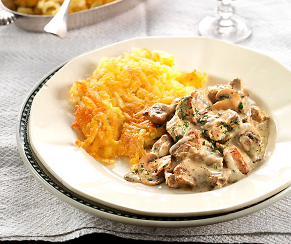
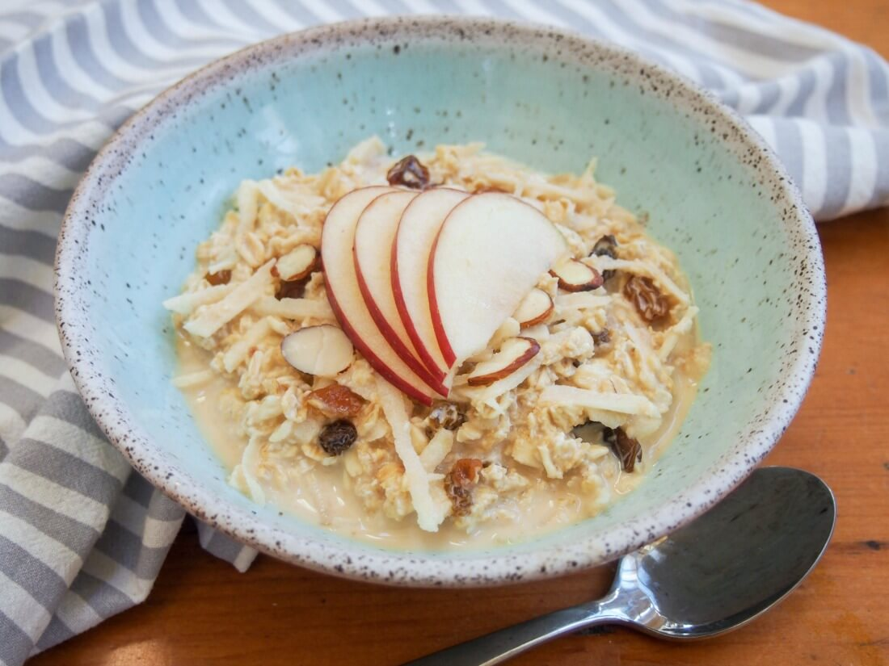
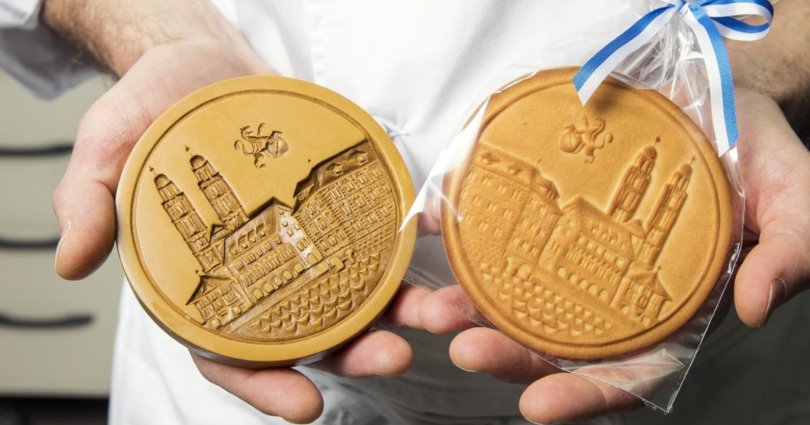
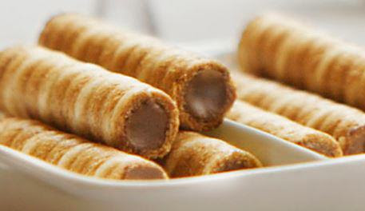
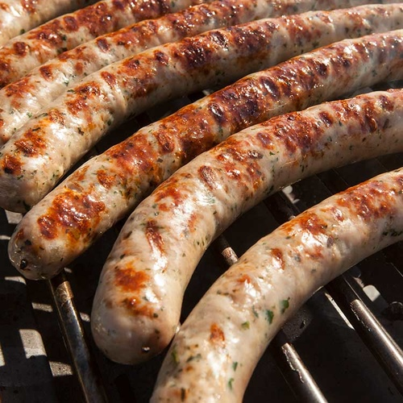
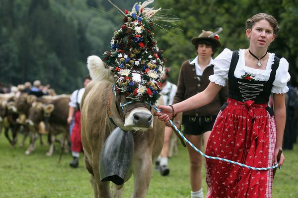

---?image=assets/img/zurich

@snap[north]
# Zürich

---

## UNB Idiomas 2019 

### Intermediário 2

 Bruno Rodrigues, Joaquim Brasil,
 Vitor Piña, Isabela Roma e Helena Tatiana

---?color=#D3D3D3

## Introduktion

---

- *In welchem Land liegt diese Stadt?*

---

Zürich  ist eine Stadt,  Hauptort des gleichnamigen Kantons Zürich. Die Stadt liegt im östlichen Schweizer Mittelland, an der Limmat am Ausfluss des Zürichsees. 

---?color=#D3D3D3

- *Vie viele Bewohner wohnen da?*

---

428.737 Bewohner

---?color=#D3D3D3

- *Wie gross ist die Stadt?*

---

Die Stadt Zürich ist mit 409'241 Einwohnern die grösste Stadt der Schweiz mit einer Bevölkerungsdichte von 4454 Einwohnern pro Quadratkilometer auf. Das Umland ist dicht besiedelt, so dass in der Agglomeration Zürich etwa 1,3 Millionen und in der Metropolitanregion Zürich etwa 1,83 Millionen Menschen leben.

---

  
## Regierung

@img[shadow](assets/img/kantonsrat.jpeg)

---

## Das Parlament
Das Kantonsparlament ist der Kantonsrat mit seinen 180 Mitgliedern. Sie werden je nach Einwohnerzahl in den Bezirken gewählt. Das Stadtparlament heißt Gemeinderat und hat 125 Mitglieder. Sie werden je nach Einwohnerzahl in den Quartieren gewählt. Beide halten ihre Sitzungen im Rathaus an der Limmat ab. 
Die Exekutive der Stadt Zürich heißt Stadtrat und hat neun Mitglieder. Die Stadt und der Kanton haben auch ihre eigenen Gerichte.

---?color=#D3D3D3

- *Welche Plätze, Parke und Denkmäler sind wichtig zu besichtigen und warum?*

---

- **Lindenhof** - Das ist ein wichtiger Platz. Auf diesem Platz gibt es alte Ruinen und die Leute können die Stadt von oben sehen.

- **Landesmuseum Zürick** - Das ist ein wichtiges historisch-kulturelle Museum mit vielen Schweizer Kunstwerke und Objekte.

- **Kunsthaus** - In diesem Museum gibt es viele Werke von großer Künstler des 19. und 20. Jahrhunderts, wie Picasso, Cézanne und Monet.

---

- **Rietberg** - In diesem Museum gibt es viele Kunstwerke aus Afrika, Asien, Indien, China und Japan.

- **Fraumünster** - Diesem Kierch für die entworfenen Glasfenster von Marc Chagall bekannt ist. 

- **Großmünster** - Das ist die Hauptkirche in Zürich. Menschen können die 187 Stufen der Türme besteigen und einen Panoramablick auf die Stadt haben.

---

- **Fluss Limmat** - Die Menschen können schwimmen und Sportarten wie Kajak fahren in diesem Fluss. Sie können auch eine Bootsfahrt machen.

 @img
 
 
---

# Typischen Spezialitäten

---

In Zürich werden verschiedene typischen spezialitäten gefindet. Die beliebtest sind:
 
- **Zürich Geschnetzeltes:**
Dieses Gericht wird aus dünn geschnittenen Streifen gebratenen Kalbfleischs in einer köstlichen cremigen Sauce zubereitet. Es wird normalerweise mit Rösti serviert.

---

---
 
- **Bircher Muesli:**
Birchermüsli oder einfach Müsli wurde 1900 von Dr. Max Bircher-Benner gegründet. Es war das Rezept für eine gesunde Ernährung. Das Müsli ist heute auf der ganzen Welt sehr beliebt und hat zahlreiche Variationen. Die Zutaten des Originalrezepts sind Hafer, Wasser, geriebener Apfel, Nüsse, Zitronensaft und Kondensmilch.

---

---
 
- **Tirggel:**
Tirggel ist ein hartes und dünnes Gebäck aus Honig, Ingwer, Anis, Koriander, Rosenwasser und Mehl. Die Oberfläche ist mit historischen Motiven aus der Vergangenheit von Zürich verziert. Es ist sehr beliebt während der Weihnachtszeit.

---

---

 
- **Straumann Hüppen:**
Hüppen sind köstliche Waffelröllchen, die oft mit Schokoladencreme gefüllt sind.

---

---
 
- **Wiedikerli:**
Die Wurst aus dem Viertel Wiedikon. Es wurde vom Metzgermeister Urs Keller entworfen. Für die Originalversion stellt die Metzgerei mageres Schweinefleisch mit gebratenen Zwiebeln, Knoblauch und Petersilie her.

---

---?color=#D3D3D3

- *Wie spricht man Deutsch  in dieser Stadt? Typischen Wörter*

---

# Sprache

---

## Beispiele:

- Grüezi = Guten Tag
- Merci= Danke
- Adie= tschüss
- ein Fötzeli= ein kleines Stück Papier

---?color=#D3D3D3

- *Haben berühmte Personen schon in dieser Stadt gelebt? Wenn ja, wer?*

---

# Berühmte Personen

---

- **Paul Thomas Mann** ist ein Romantik  Schriftsteller, er sind an 1875 geboren und in 1936 hat er zu Zürich geändert. Er hat in Zürich von 1936   nach 1955 gelebt. Thomas war wichtig für Literatur weil er ein nobel prize gewonnen hat. 

- **James Joyce** war auch ein Schriftsteller, er war in 1882 geboren in Dublin, er hat zu Zürich geändert in 1920.  

---

- **Lenin** war ein politik, Führer der kommunistischen Partei, hat zu Zürich im 1916 geändert.

- **Albert Einstein**, er hat in zürich gelebt in 1896 mit seine Frau Mileva Marić , er hat nach Zürich gelebt weil er an der eidgenössische polytechnische Schulen studiert hat.

---

# **Merci vilmal!**

---
 
- **Bircher Muesli:**
Birchermüsli oder einfach Müsli wurde 1900 von Dr. Max Bircher-Benner gegründet. Es war das Rezept für eine gesunde Ernährung. Das Müsli ist heute auf der ganzen Welt sehr beliebt und hat zahlreiche Variationen. Die Zutaten des Originalrezepts sind Hafer, Wasser, geriebener Apfel, Nüsse, Zitronensaft und Kondensmilch.

---

---
 
- **Tirggel:**
Tirggel ist ein hartes und dünnes Gebäck aus Honig, Ingwer, Anis, Koriander, Rosenwasser und Mehl. Die Oberfläche ist mit historischen Motiven aus der Vergangenheit von Zürich verziert. Es ist sehr beliebt während der Weihnachtszeit.

---

 
- **Straumann Hüppen:**
Hüppen sind köstliche Waffelröllchen, die oft mit Schokoladencreme gefüllt sind.

---
 
- **Wiedikerli:**
Die Wurst aus dem Viertel Wiedikon. Es wurde vom Metzgermeister Urs Keller entworfen. Für die Originalversion stellt die Metzgerei mageres Schweinefleisch mit gebratenen Zwiebeln, Knoblauch und Petersilie her.

---

---

- *Wie spricht man Deutsch  in dieser Stadt? Typischen Wörter*

#### Beispiele:

- Grüezi = Guten Tag
- Merci= Danke
- Adie= tschüss
- ein Fötzeli= ein kleines Stück Papier

---

- *Haben berühmte Personen schon in dieser Stadt gelebt? Wenn ja, wer?*

- **Paul Thomas Mann** ist ein Romantik  Schriftsteller, er sind an 1875 geboren und in 1936 hat er zu Zürich geändert. Er hat in Zürich von 1936   nach 1955 gelebt. Thomas war wichtig für Literatur weil er ein nobel prize gewonnen hat. 

- **James Joyce** war auch ein Schriftsteller, er war in 1882 geboren in Dublin, er hat zu Zürich geändert in 1920.  
- **Lenin** war ein politik, Führer der kommunistischen Partei, hat zu Zürich im 1916 geändert.

- **Albert Einstein**, er hat in zürich gelebt in 1896 mit seine Frau Mileva Marić , er hat nach Zürich gelebt weil er an der eidgenössische polytechnische Schulen studiert hat.

---

# **Merci vilmal!**

 
---

- **Rathaus** - Das Rathausgebäude befindet sich am linken Ufer des Flusses in der Altstadt.

- **Zürichsee** - Rund um den See gibt es eine tolle Spielwiese. Dort kann man laufen und skaten. Auf dem See die Leute können auch eine Bootsfahrt machen.

- **Zürich westen** - Das ist ein sehr schön und cult Nachbarschaft, mit viel Kunst, Kultur und moderner Architektur. 

---?color=#D3D3D3

- *Was sind die typischen Spezialitäten dieser Stadt?*

---

## Die Schweizer Küche

Die Schweizer Küche wird von Nachbarländern wie Frankreich, Deutschland, Italien, Österreich und Liechtenstein beeinflusst. Die Gerichte variieren je nach der in der Region gesprochenen Sprache. Jedoch, einige Gerichte sind in der ganzen Schweiz beliebt, wie Käsefondue und Rösti. Andere berühmte produkte sind Schokolade und Käse.

---

### Zürich

Zürich bietet ausgezeichnete gastronomische Möglichkeiten. Es gibt viele Restaurants. 17 Restaurants hat Michelin-Sterne. Der Michelin-Stern ist die wichtigste und traditionellste Auszeichnung, die einem Restaurant verliehen wird.

---

---

#### Typischen Spezialitäten

In Zürich werden verschiedene typischen spezialitäten gefindet. Die beliebtest sind:
 
- **Zürich Geschnetzeltes:**
Dieses Gericht wird aus dünn geschnittenen Streifen gebratenen Kalbfleischs in einer köstlichen cremigen Sauce zubereitet. Es wird normalerweise mit Rösti serviert.

---  

---
 
- **Bircher Muesli:**
Birchermüsli oder einfach Müsli wurde 1900 von Dr. Max Bircher-Benner gegründet. Es war das Rezept für eine gesunde Ernährung. Das Müsli ist heute auf der ganzen Welt sehr beliebt und hat zahlreiche Variationen. Die Zutaten des Originalrezepts sind Hafer, Wasser, geriebener Apfel, Nüsse, Zitronensaft und Kondensmilch.

---

---
 
- **Tirggel:**
Tirggel ist ein hartes und dünnes Gebäck aus Honig, Ingwer, Anis, Koriander, Rosenwasser und Mehl. Die Oberfläche ist mit historischen Motiven aus der Vergangenheit von Zürich verziert. Es ist sehr beliebt während der Weihnachtszeit.

---

 
- **Straumann Hüppen:**
Hüppen sind köstliche Waffelröllchen, die oft mit Schokoladencreme gefüllt sind.

---
 
- **Wiedikerli:**
Die Wurst aus dem Viertel Wiedikon. Es wurde vom Metzgermeister Urs Keller entworfen. Für die Originalversion stellt die Metzgerei mageres Schweinefleisch mit gebratenen Zwiebeln, Knoblauch und Petersilie her.

---

---

- *Wie spricht man Deutsch  in dieser Stadt? Typischen Wörter*

#### Beispiele:

- Grüezi = Guten Tag
- Merci= Danke
- Adie= tschüss
- ein Fötzeli= ein kleines Stück Papier

---

- *Haben berühmte Personen schon in dieser Stadt gelebt? Wenn ja, wer?*

- **Paul Thomas Mann** ist ein Romantik  Schriftsteller, er sind an 1875 geboren und in 1936 hat er zu Zürich geändert. Er hat in Zürich von 1936   nach 1955 gelebt. Thomas war wichtig für Literatur weil er ein nobel prize gewonnen hat. 

- **James Joyce** war auch ein Schriftsteller, er war in 1882 geboren in Dublin, er hat zu Zürich geändert in 1920.  
- **Lenin** war ein politik, Führer der kommunistischen Partei, hat zu Zürich im 1916 geändert.

- **Albert Einstein**, er hat in zürich gelebt in 1896 mit seine Frau Mileva Marić , er hat nach Zürich gelebt weil er an der eidgenössische polytechnische Schulen studiert hat.

---

# **Merci vilmal!**

@title[Customize Slide Layout]

@snap[west span-50]
## Customize Slide Content Layout
@snapend

@snap[east span-50]

@snapend

---?color=#E58537
@title[Add A Little Imagination]

@snap[north-west]
#### Add a splash of @color[cyan](**color**) and you are ready to start presenting...
@snapend

@snap[west span-55]
@ul[spaced text-white]
- You will be amazed
- What you can achieve
- *With a little imagination...*
- And **GitPitch Markdown**
@ulend
@snapend

@snap[east span-45]
@img[shadow](assets/img/conference.png)
@snapend

---?image=assets/img/presenter.jpg

@snap[north span-100 headline]
## Now It's Your Turn
@snapend

@snap[south span-100 text-06]
[Click here to jump straight into the interactive feature guides in the GitPitch Docs @fa[external-link]](https://gitpitch.com/docs/getting-started/tutorial/)
@snapend
